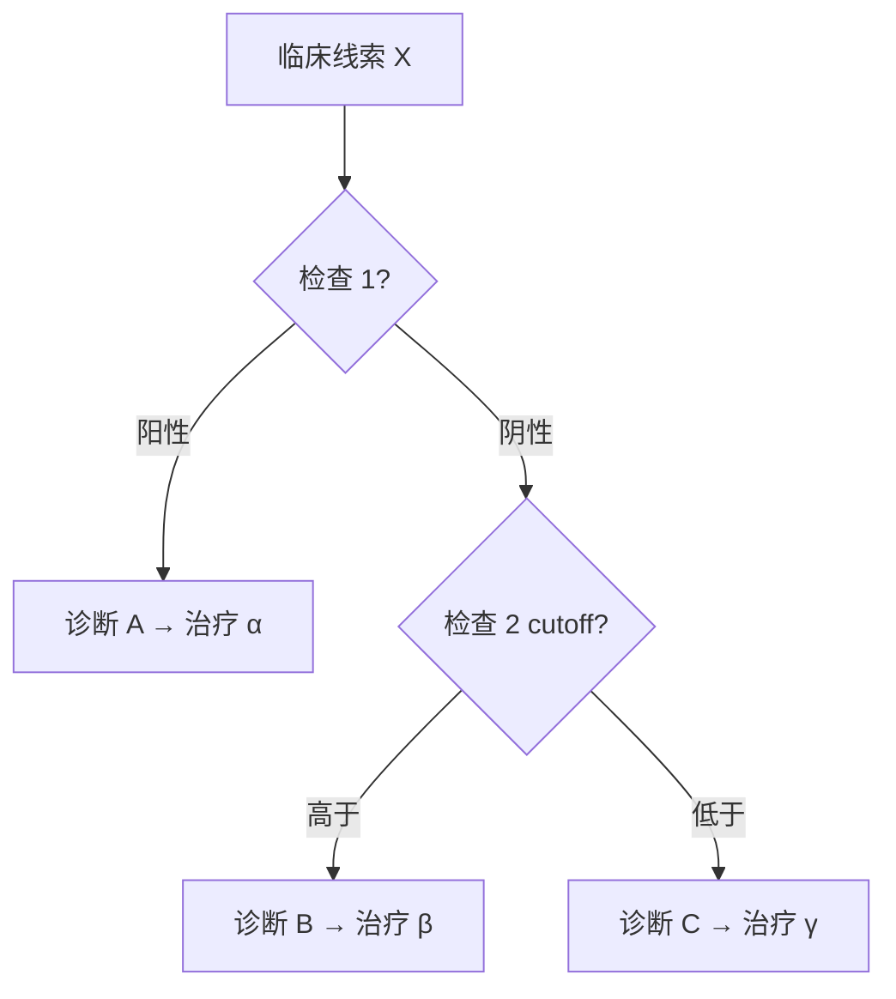

# UW#[题号] - [一句话题型描述]

## 📋 元信息
- 📅 日期：YYYY-MM-DD
- 🏥 系统：[心血管 / 内分泌 / 肾脏 / ...]
- 🔖 子系统：[具体疾病或机制]
- 难度：⭐⭐⭐
- 标签：#错因类型 #高频考点

## 🩺 病例特征（提炼版，不保留原文）
[用 3-5 句话提炼临床场景：年龄/性别/主诉/关键体征/关键化验]

## ❌ 我的答案 vs ✅ 正确答案
- 我选：X — [我当时的思路]
- 正解：Y — [正确的关键证据]

## 🧠 错因分类
- [ ] 知识盲区（不会）
- [ ] 鉴别诊断不全
- [ ] 题干陷阱没看出
- [ ] 计算/数值错误
- [ ] 临床思维偏差
- [ ] 其他：_______

## 📚 疾病原理与可视化（基于通用医学知识，非 UW 原文）

> 这部分由 Claude Code 基于 **First Aid / Master the Boards / UpToDate / AMBOSS** 等通用医学知识整合，
> 用于深入理解疾病机制，**不是 UW 原图复制**。

### 🔬 病理生理机制
[用 Markdown 列表或简短段落解释，让我能"想通"为什么这道题答案是 Y]

例：
- 触发因素 → ...
- 关键介质 / 通路 → ...
- 终末效应 → ... → 临床表现

### 📊 鉴别诊断对比表

| 特征 | 疾病 A | 疾病 B | 疾病 C |
|------|--------|--------|--------|
| 典型人群 | ...    | ...    | ...    |
| 主诉/体征 | ...    | ...    | ...    |
| 关键化验 | ...    | ...    | ...    |
| 影像/ECG | ...    | ...    | ...    |
| 一线治疗 | ...    | ...    | ...    |

### 🌳 临床决策流程图

**方式 A：纯文字流程图**

```
临床线索 X
    │
    ├─ 检查 1 阳性 ─→ 诊断 A → 治疗 α
    │
    └─ 检查 1 阴性
            │
            ├─ 检查 2 ＞ cutoff ─→ 诊断 B → 治疗 β
            │
            └─ 检查 2 ＜ cutoff ─→ 诊断 C → 治疗 γ
```

**方式 B：Mermaid 流程图（Obsidian 可渲染）**



### 🔢 关键数值 / 界值
- 重要 cutoff：...
- 必背公式：...
- 时间窗：...

## 🎯 高频考点提炼
1. [核心考点 1]
2. [核心考点 2]
3. [易错陷阱]

## 🔗 关联笔记
- [[notes/cardiovascular]]
- [[notes/endocrine]]

## 🚨 复习提醒
- 下次遇到 **[关键词/线索]** 时，记得 [应对方法/必查项]
- 易混淆的兄弟疾病：...
- "看到 X 想到 Y"：...

## 📅 复习记录
- [ ] 首次记录：YYYY-MM-DD
- [ ] 1 周后复习：YYYY-MM-DD
- [ ] 1 月后复习：YYYY-MM-DD
- [ ] 考前 2 周复习：YYYY-MM-DD
