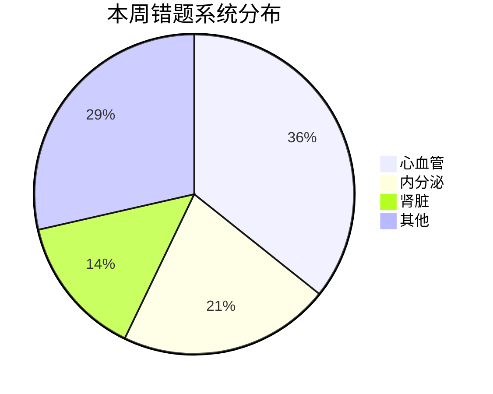

# 📊 错题周总结 — YYYY-MM-DD ~ YYYY-MM-DD（Week WW）

> 每周日填写。扫描本周 `mistakes/YYYY-MM-DD.md`，做统计 + 反思 + 下周计划。

---

## 1. 📈 本周做题统计

| 指标 | 数值 |
|------|------|
| 做题总量 | __ |
| 错题数 | __ |
| 错题率 | __% |
| 用时（小时） | __ |
| 平均每题（秒） | __ |
| 与上周对比 | ↑ / ↓ / → |

**目标 vs 实际**：本周计划 ___ 题，实际完成 ___ 题。

## 2. 🏥 系统错题分布

| 系统 | 错题数 | 占比 |
|------|--------|------|
| Cardiovascular | __ | __% |
| Endocrine | __ | __% |
| Renal | __ | __% |
| ... | __ | __% |

**Mermaid 可视化**（Obsidian 可渲染）：

## 3. 🧠 三大思维错误模式

> 同一类错因 ≥ 3 次就算"模式"，需要专项纠正。

1. **错误模式 1**：发生 __ 次
   - 表现：[如"看到胸痛就直奔 ACS，没考虑主动脉夹层 / PE / 心包炎"]
   - 改进：[如"建立胸痛鉴别 checklist，必查 D-dimer / 胸 X 线"]

2. **错误模式 2**：发生 __ 次
   - 表现：...
   - 改进：...

3. **错误模式 3**：发生 __ 次
   - 表现：...
   - 改进：...

## 4. 🔥 高频出错知识点 Top 5

| # | 知识点 | 错题号 | 关联笔记 |
|---|--------|--------|---------|
| 1 | ... | UW#__, UW#__ | [[notes/xxx]] |
| 2 | ... | UW#__ | [[notes/xxx]] |
| 3 | ... | UW#__ | [[notes/xxx]] |
| 4 | ... | UW#__ | [[notes/xxx]] |
| 5 | ... | UW#__ | [[notes/xxx]] |

## 5. 📚 下周重点复习清单

| 优先级 | notes/ 文件 | 重点章节 | 关联错题 | 预计时长 |
|--------|------------|---------|---------|---------|
| 🔴 高 | cardiovascular.md | §1 缺血性心脏病 | UW#123, UW#456 | __ min |
| 🔴 高 | endocrine.md | §2 甲状腺 | UW#789 | __ min |
| 🟡 中 | renal-urinary.md | §4 电解质 | UW#234 | __ min |
| 🟢 低 | ... | ... | ... | __ min |

## 6. 💡 进步与反思

### ✅ 做对的事
- [如"鉴别诊断时养成了写 differential 的习惯"]
- ...

### ⚠️ 待改进
- [如"读题太快，漏看 vital signs"]
- ...

### 🌡️ 状态/节奏/情绪
- 学习节奏：...
- 睡眠/精力：...
- 情绪压力：...

## 7. 🔁 重做推荐

> 下周抽时间重做的题（不是单纯看答案，而是重新做一遍）。

- [ ] UW#___ — 因为 [当时凭运气蒙对 / 错因模式 1 / 涉及高频考点]
- [ ] UW#___ — 因为 ...
- [ ] UW#___ — 因为 ...

## 8. 📌 给下周自己的话

> 一句最重要的提醒。

[例：读题先圈 vital signs 与 timeline，再看选项]

---

## 9. 📅 下周计划

- [ ] 完成 ___ 道 UWorld
- [ ] 重看 ___ 个系统笔记
- [ ] 重做以上推荐错题
- [ ] 模考：[ ] 是 / [ ] 否（如是：哪一份？）
